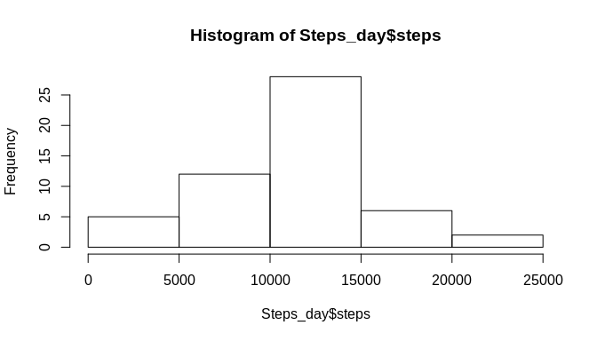
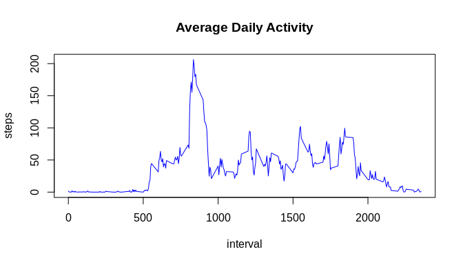
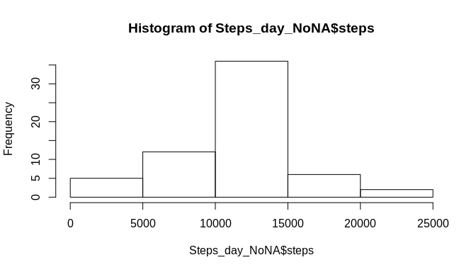
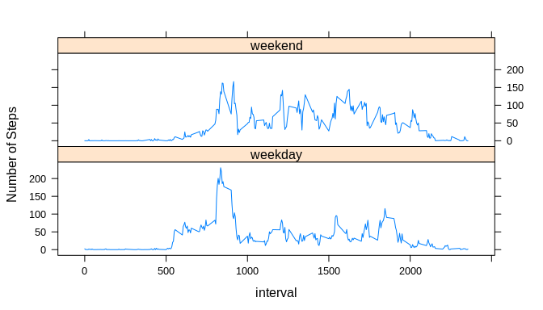

## Loading and preprocessing the data  

```r
unzip("repdata_data_activity.zip")
activity <- read.csv("activity.csv")
```


## What is mean total number of steps taken per day?  
Histogram of the total number of steps taken each day. First is necesary to summarize the steps by day.  

```r
Steps_day <- aggregate(steps ~ date, activity, sum, na.rm=TRUE)
```
This is the histogram.  

```r
hist(Steps_day$steps)
```

<!-- -->
  
Mean and median number of steps taken each day  


```r
mean_Steps_day <- mean(Steps_day$steps)
mean_Steps_day
```

```
## [1] 10766.19
```


```r
median_Step_day <- median(Steps_day$steps)
median_Step_day
```

```
## [1] 10765
```

## What is the average daily activity pattern?  
First is necesary calculate the mean of steps per inteval.  

```r
stepsperInterval <- aggregate(steps~interval, data = activity, mean, na.rm = TRUE)
```

And then we can see the time serie plot.  


```r
plot(steps~interval, data = stepsperInterval, type="l", col="blue", main ="Average Daily Activity")
```

<!-- -->

The 5-minute interval that, on average, contains the maximum number of steps  

```r
MaxSteps <- stepsperInterval[which.max(stepsperInterval$steps),1]
MaxSteps
```

```
## [1] 835
```


## Imputing missing values  
We are calculating and reporting the total number of missing values in the dataset activity.

```r
totalNA <- sum(is.na(activity$steps))
totalNA
```

```
## [1] 2304
```
To Generate a value for an interval that have missing values in the step variable we are using the mean of step per interval.

```r
source("getmeaninaterval.R")
getmeaninaterval
```

```
## function (interval, stepsperInterval) 
## {
##     getmean <- stepsperInterval[stepsperInterval$interval == 
##         interval, ]$steps
##     getmean
## }
```

First is necesary generate a new Dataframe with the originasl dataframe and then fill all the missing values for steps.  


```r
NoNA_activity <- activity

totalrows <- nrow(NoNA_activity)

for (i in 1:totalrows) {
  if(is.na(NoNA_activity[i,]$steps)) {
    NoNA_activity[i,]$steps <- getmeaninaterval(NoNA_activity[i,]$interval, stepsperInterval)
  }
  
}
```

Now we validate that the number of NA in the new dataframe is zero.  

```r
totalNA <- sum(is.na(NoNA_activity$steps))
totalNA
```

```
## [1] 0
```

generating a histogram of the total number of steps taken each day and Calculate and report the mean and median total number of steps taken per day.  


```r
Steps_day_NoNA <- aggregate(steps ~ date, NoNA_activity, sum)  
```
Histogram of the total steps per day. with no NA values.  


```r
hist(Steps_day_NoNA$steps)
```

<!-- -->

Mean and median number of steps taken each day in the dataframe with No NA values.  


```r
meanSteps_NoNA <- mean(Steps_day_NoNA$steps)
meanSteps_NoNA
```

```
## [1] 10766.19
```


```r
medianSteps_NoNA <- median(Steps_day_NoNA$steps)
medianSteps_NoNA
```

```
## [1] 10766.19
```

## Are there differences in activity patterns between weekdays and weekends?

Creating a new factor variable in the dataset with two levels – “weekday” and “weekend” indicating whether a given date is a weekday or weekend day.  


```r
NoNA_activity$date <- as.Date(strptime(NoNA_activity$date, format="%Y-%m-%d"))

NoNA_activity$day <- weekdays(NoNA_activity$date)


for (i in 1:totalrows) {
  if(NoNA_activity[i,]$day %in% c("Saturday","Sunday")) {
    NoNA_activity[i,]$day <- "weekend"
  }
  else {
    NoNA_activity[i,]$day <-  "weekday"
  }
  
}

NoNA_activity$day <- as.factor(NoNA_activity$day)
```

Now we create a time series panel plot of the 5-minute interval and the average number of steps taken, averaged across all weekday days or weekend days.  


```r
Steps_by_Day <- aggregate(NoNA_activity$steps ~ NoNA_activity$interval+NoNA_activity$day, NoNA_activity, mean)
names(Steps_by_Day) <- c("interval", "day", "steps")
library(lattice)
```

The library Lattice is used to generate the panel plot.


```r
xyplot(steps ~ interval | day, Steps_by_Day, type = "l", layout = c(1, 2), ylab = "Number of Steps")
```

<!-- -->
